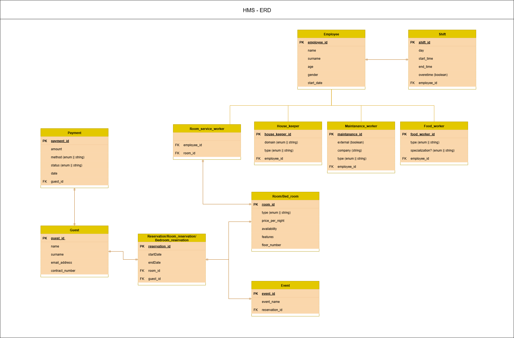

## Project: 	Hotel-booking System
- Started: 	12.03.25
- Updated: 	16.09.25
- Status: 	work-in-progress
- Branch:	master-dev1
---

### Software-class Diagram

=======

### About project
- A Java project for managing a hotel-reservation system, created using the IntelliJ IDE 


### Download
```
git clone https://github.com/ammaar0x01/ADP3_capstone_project.git
OR
git clone --branch [branch-name] https://github.com/ammaar0x01/ADP3_capstone_project.git
```


### Execute
- Load and run the project using the IntelliJ IDE
---
