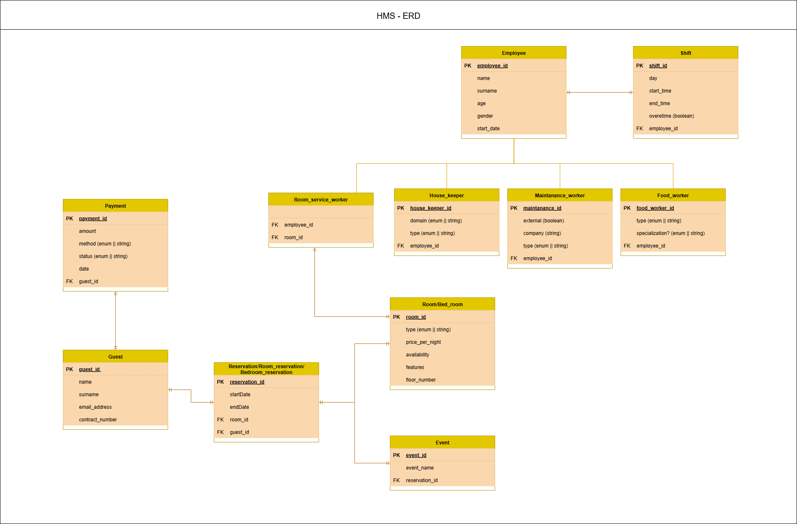

## Project: 	Hotel-booking System
- Started: 	12.03.25
- Updated: 	16.09.25
- Status: 	work-in-progress
- Branch:	master-dev1
---

### Software-class Diagram

=======

### About project
- A Java project for managing a hotel-reservation system, created using the IntelliJ IDE 


### Download
```
git clone https://github.com/ammaar0x01/ADP3_capstone_project.git
OR
git clone --branch [branch-name] https://github.com/ammaar0x01/ADP3_capstone_project.git
```


### Execute
- Load and run the project using the IntelliJ IDE
---

zaids dashboard
first thing had to change /view in his controller to /scenes
so files were picked up.

Then to get css working called stylesheets and applied 
when switching page

then had to change resolution to 1100 x 600


-----


-------
updating UI's steps
rename to eg reservationFinal.fxml
change controller to what the old ugly ui is using.
now u need to change method calls inside the new fxml, to 
whats in the controller u just added. so put old ui and new ui fxml side by side
and change new uis on action to old uis on action for thte 3 buttons add del update

then u need to change fx:id of table columns in new ui fxml, to match
the controllers fxid for table columns. ALso u need to match
controller table name fxid fx:id="reservationTable" for tableview,
so not just columns

also for every file load from now on needs
loader.setControllerFactory(MainFinal.getSpringContext()::getBean);
GETTING SPRINGBOOT FROM MAINFINAL.  ITS THE ONLY ENTRY TO PROGRAM


---
FIXES ive needed to use more than once
---
1. changing loader.applciaton.getcontext
to mainFinal.context method call. so in old controller
u just need to tell it, use new mainFinal springboot context.
simple

2. if u have cascade on resrvation and delte from there
it works fine, but if u delete from child view, so event,
event entity will also need cascade. then it fixed
deleting in event page.

----
CURRENT BUGS AND LOGIC ERRs
---
style="-fx-background-color: white;" causes right graphical glitch
why

---
can be easy fix
--
1 easy fix, i removed extra cols, so tableview witdth needs to
be reduced to reemove ugfly ui grapgical glitch or u need columns
to take taht space. either or,

---
fixed
--
2 delete from reservation deletes
room of id whatever when u delete a reservation
so then u end up with no rooms in room table. big logic 

fixed, had to change room and reservatgion entity
from cascade. had to make room object null when deleting
reservation. had to edit resrvationservice delet emethod
and roomreposiory and add things to top of resrvatioinservice
its complicted

-fix im guessing remove deletecascade within that relationsip.
then when u delte from reservation, run update avaialbity
in room?


need to add payment window to
event after event added, also go to payment
like room does

u must insert into db now otherwise room page
will break. it pulls rooms from db to work now
so ui mirrors db in room page


5 new flow needs to be,
on add guestresrvaitons, remove
update and delete or something buttons
then i ndash u still need to beable to atleasy
viwe and update reservaiton. even if u cant add new


3 whats stopping people adding reservation
without adding guest first. on dashboard
they can do any order. so we have to prevent
that cause fk err if they add reservation with no guest
??? should the flow be, dont show addres.
only show add guest, which then after adding
guest it opens res then event.??

5. also i think reservation, needs number of guests
cause 1 reseration could be for a group/family for a room
so currently we only take single people so maybe fix this
----
to add muaaths and make mine run i commented out had to
return new javafx.beans.property.SimpleIntegerProperty(
//                emp.getUser() != null ? emp.getUser().getId() : 0
).asObject();
});
in employeecontrollerview, its probs important for future things


- So basically, Spring Security is only being used 
- as a backend authentication framework, not as a web filter chain.


talias one service iservice i had to rename
to emplyeesalaryservice cause she named it wrong.
keep in mind if the methods dont work
cause they calling wrong service or something


---
todo:
---
add payment after event like for room
insert register must be connected to employee insert there same time
connect upper erd other stuff.
make windows close when making res to stop desolate records
cards get data from a table
when login have image and get name from user table and display it
